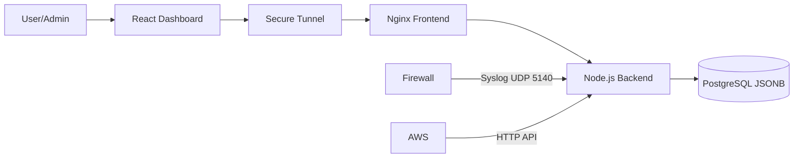
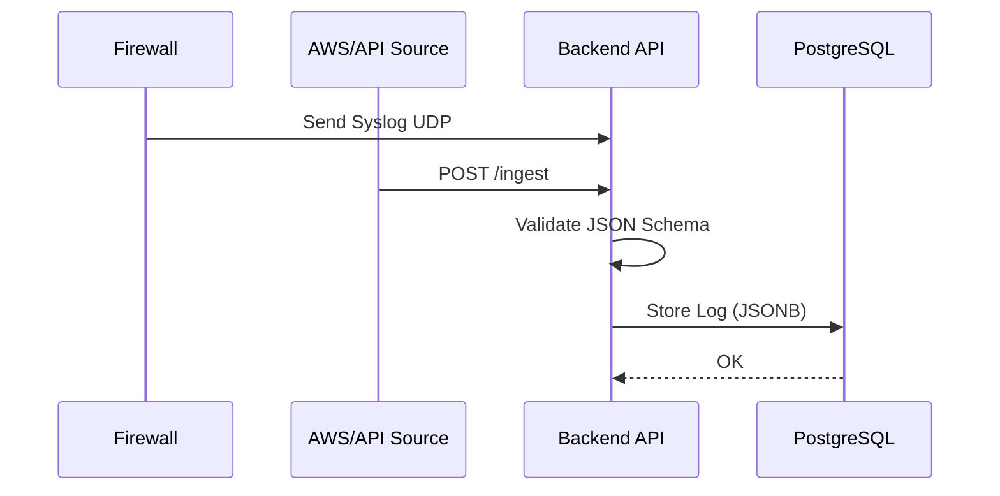

# Log Management System Architecture

## Overview

ระบบจัดการ Log แบบ Centralized รองรับการทำงานทั้งรูปแบบ Appliance และ SaaS โดยเน้นความง่ายในการติดตั้ง (Containerized) และประสิทธิภาพในการค้นหา

---

## Technology Stack

* **Frontend:** React (Vite) + TailwindCSS + Recharts
* **Backend:** Node.js (Express) + UDP Syslog Server
* **Database:** PostgreSQL (JSONB Storage)
* **Infrastructure:** Docker Compose + Ngrok / Serveo

---

## Data Flow Diagram

> GitHub รองรับ Mermaid โดยตรง จึงแสดงผลเป็น **แผนภาพอัตโนมัติ** (ไม่ต้องแปลงเป็นรูปภาพ)

### 1. System Architecture Flow (Overview Diagram)



### 2. Data Ingestion Sequence (Flow Step Diagram)



### Flow Summary

1. Log ถูกส่งเข้ามาจาก Firewall (UDP) หรือ Cloud/API (HTTP)
2. Backend ตรวจสอบ Schema
3. บันทึกข้อมูลลง PostgreSQL JSONB
4. Frontend ดึงข้อมูลผ่าน REST API
5. User วิเคราะห์ผ่าน Dashboard

```mermaid
graph TD
    subgraph Client_Side [Client Side]
        User["👤 User / Admin"]
        Browser["💻 Dashboard (React)"]
    end

    subgraph SaaS_Layer [SaaS / Cloud Layer]
        Tunnel["🌐 Secure Tunnel (Serveo/Ngrok)"]
    end

    subgraph Appliance [Appliance (Docker Container)]
        Frontend["🎨 Frontend (Nginx)"]
        Backend["⚙️ Backend API (Node.js)"]
        DB[("🗄️ PostgreSQL JSONB")]
    end

    subgraph Data_Sources [Data Sources]
        Firewall["🔥 Firewall (Syslog UDP)"]
        AWS["☁️ AWS / API (HTTP)"]
    end

    %% Flow Connections
    User -->|HTTPS| Tunnel
    Tunnel -->|Forward 80| Frontend
    Frontend -->|API Req| Backend
    Backend -->|Query/Store| DB

    %% Ingestion Flow
    Firewall -->|UDP 5140| Backend
    AWS -->|POST /ingest| Backend

    %% Styling
    style DB fill:#f9f,stroke:#333,stroke-width:2px
    style Backend fill:#bbf,stroke:#333,stroke-width:2px
    style Tunnel fill:#dfd,stroke:#333,stroke-width:2px
```

---

## Database Schema

เราใช้ **JSONB** ใน PostgreSQL เพื่อความยืดหยุ่นในการเก็บ Log จากแหล่งที่ต่างกันโดยไม่ต้องแก้ Table Structure บ่อยๆ

| Column    | Type        | Description                         |
| --------- | ----------- | ----------------------------------- |
| timestamp | TIMESTAMPTZ | เวลาที่เกิดเหตุการณ์ (Indexed)      |
| tenant_id | VARCHAR     | รหัสลูกค้า (Multi-tenant Isolation) |
| source    | VARCHAR     | แหล่งที่มา (aws, firewall, api)     |
| metadata  | JSONB       | ข้อมูลดิบทั้งหมด (GIN Indexed)      |

### Example Table SQL

```sql
CREATE TABLE logs (
  id SERIAL PRIMARY KEY,
  timestamp TIMESTAMPTZ NOT NULL,
  tenant_id VARCHAR(100) NOT NULL,
  source VARCHAR(50) NOT NULL,
  metadata JSONB NOT NULL
);

CREATE INDEX idx_logs_timestamp ON logs(timestamp);
CREATE INDEX idx_logs_metadata ON logs USING GIN(metadata);
```

---

## Security Design

* **Multi-tenancy:** แยกข้อมูลระดับ Row-level (Software Isolation)
* **Validation:** ตรวจสอบ JSON Schema ก่อนบันทึกข้อมูล
* **Transport:** HTTPS / Secure Tunnel
* **Access Control:** Role-based access (Admin / User)

---

## API Example

### Ingest Log

```http
POST /ingest
Content-Type: application/json
```

```json
{
  "tenant_id": "tenant_001",
  "source": "aws",
  "metadata": {
    "service": "ec2",
    "level": "error",
    "message": "Instance unreachable"
  }
}
```

---

## Deployment

```bash
docker compose up -d
```

รองรับการใช้งานทั้งแบบ

* On‑Prem Appliance
* SaaS ผ่าน Secure Tunnel

---

## Future Improvements

* Full‑text search (PostgreSQL + OpenSearch)
* Log Retention Policy
* Alert & Notification System
* Dashboard Custom Widget

---

## License

MIT License
