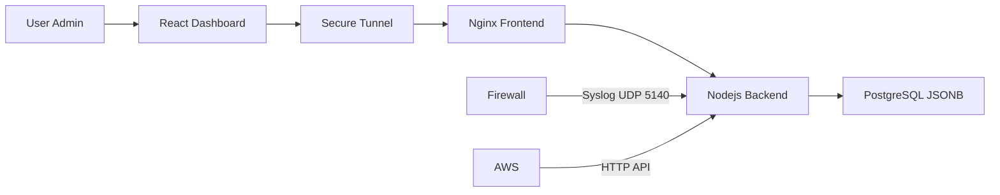
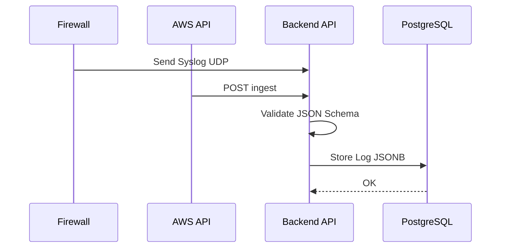
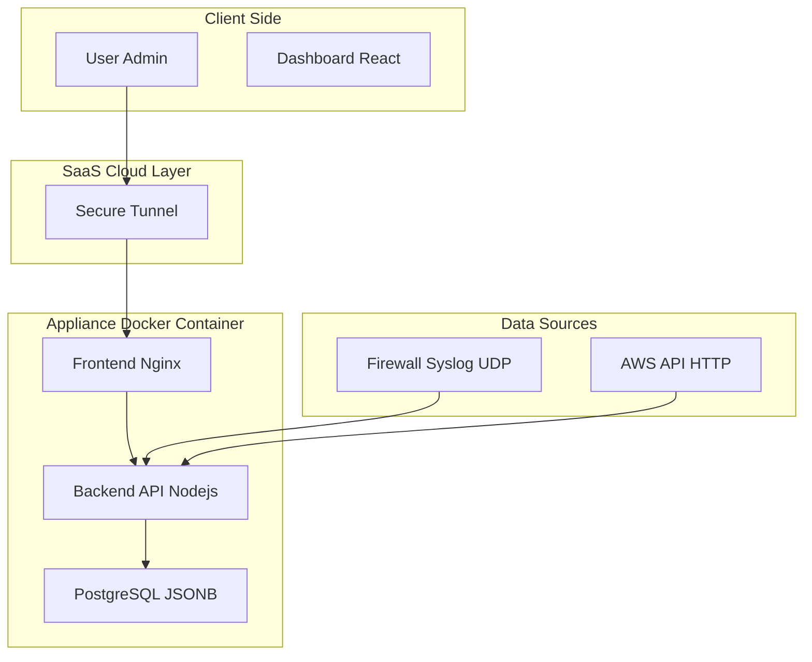

# Log Management System Architecture

## Overview

ระบบจัดการ Log แบบ Centralized รองรับการทำงานทั้งรูปแบบ Appliance และ SaaS โดยเน้นความง่ายในการติดตั้ง (Containerized) และประสิทธิภาพในการค้นหา

---

## Technology Stack

* **Frontend:** React (Vite) + TailwindCSS + Recharts
* **Backend:** Node.js (Express) + UDP Syslog Server
* **Database:** PostgreSQL (JSONB Storage)
* **Infrastructure:** Docker Compose + Ngrok / Serveo

---

## Data Flow Diagram

### 1. System Architecture Flow



---

### 2. Data Ingestion Sequence



---

### 3. System Flow (Detailed View)



---

## Database Schema

เราใช้ **JSONB** ใน PostgreSQL เพื่อความยืดหยุ่นในการเก็บ Log จากแหล่งที่ต่างกันโดยไม่ต้องแก้ Table Structure บ่อยๆ

| Column    | Type        | Description                         |
| --------- | ----------- | ----------------------------------- |
| timestamp | TIMESTAMPTZ | เวลาที่เกิดเหตุการณ์ (Indexed)      |
| tenant_id | VARCHAR     | รหัสลูกค้า (Multi-tenant Isolation) |
| source    | VARCHAR     | แหล่งที่มา (aws, firewall, api)     |
| metadata  | JSONB       | ข้อมูลดิบทั้งหมด (GIN Indexed)      |

### Example Table SQL

```sql
CREATE TABLE logs (
  id SERIAL PRIMARY KEY,
  timestamp TIMESTAMPTZ NOT NULL,
  tenant_id VARCHAR(100) NOT NULL,
  source VARCHAR(50) NOT NULL,
  metadata JSONB NOT NULL
);

CREATE INDEX idx_logs_timestamp ON logs(timestamp);
CREATE INDEX idx_logs_metadata ON logs USING GIN(metadata);
```

---

## Security Design

* **Multi-tenancy:** แยกข้อมูลระดับ Row-level (Software Isolation)
* **Validation:** ตรวจสอบ JSON Schema ก่อนบันทึกข้อมูล
* **Transport:** HTTPS / Secure Tunnel
* **Access Control:** Role-based Access Control

---

## API Example

### Ingest Log

```http
POST /ingest
Content-Type: application/json
```

```json
{
  "tenant_id": "tenant_001",
  "source": "aws",
  "metadata": {
    "service": "ec2",
    "level": "error",
    "message": "Instance unreachable"
  }
}
```

---

## Deployment

```bash
docker compose up -d
```

รองรับการใช้งานทั้งแบบ

* On-Prem Appliance
* SaaS ผ่าน Secure Tunnel

---

## Future Improvements

* Full-text search (PostgreSQL + OpenSearch)
* Log Retention Policy
* Alert and Notification System
* Dashboard Custom Widget

---
